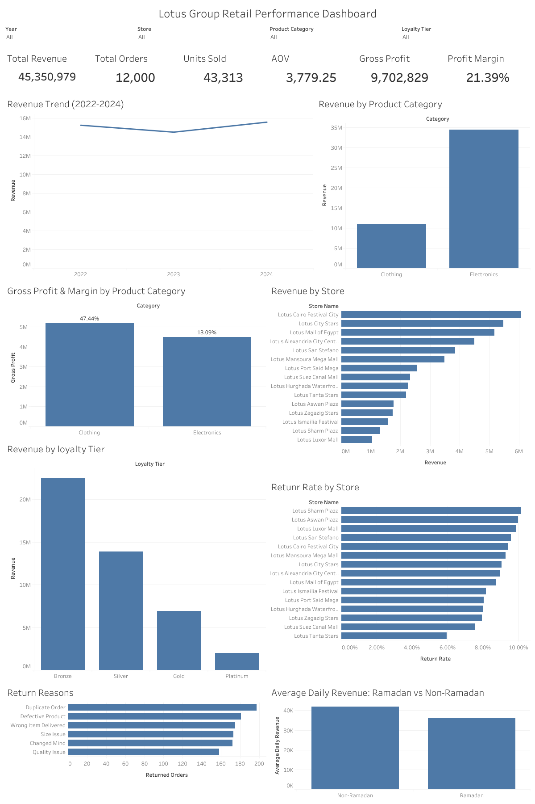

# Analyzing Retail Revenue, Profitability & Operational Performance Using SQL and Tableau

## ℹ️ Overview

This project analyzes Lotus Group's retail performance across stores, products, customers, and time using SQL and Tableau Public.

Using three years of retail data from **2022–2024**, the analysis evaluates revenue, profitability, customer performance, and operational metrics to understand how the business is performing and identify opportunities to improve revenue, profitability, and operational performance.

The project follows an end-to-end analytical workflow, from **data validation and preparation in SQL** through **business-focused analysis, KPI development, data modeling, and interactive Tableau dashboard development**.

## 📊 Dashboard

**Tableau Public:** [View the Interactive Dashboard](https://public.tableau.com/views/LotusGroupRetailPerformanceAnalysis/LotusGroupRetailPerformanceDashboard)



## 📂 Dataset

**Source:** [Lotus Group Retail Star Schema BI Dataset](https://www.kaggle.com/datasets/abdelrahmanmahmoud22/lotus-group-retail-star-schema-bi)

The dataset contains retail transaction and master data covering **January 2022 through December 2024**, including information on customers, products, stores, employees, orders, order details, dates, and returns.

## 🛠️ Analytical Workflow

### 1. SQL Data Preparation
- Validated the structure and quality of the source data.
- Identified and removed duplicate customer records.
- Standardized inconsistent categorical values.
- Converted text-based date fields into proper date types.
- Combined the 2022–2023 and 2024 order tables into a unified order-level analytical view.
- Validated key relationships and record counts.

### 2. SQL Analysis
Analyzed:
- Sales and revenue performance
- Year-over-year revenue growth
- Store and regional performance
- Product and category performance
- Gross profit and profit margin
- Customer and loyalty-tier performance
- Return rates and return reasons
- Revenue per employee
- Ramadan vs. non-Ramadan performance

### 3. Tableau Public
- Built a relational data model using the prepared SQL datasets.
- Developed calculated fields for core business KPIs.
- Validated Tableau metrics against SQL results.
- Designed an interactive dashboard for performance monitoring and exploration.

## 📈 Key Insights

- Total revenue reached **45.35M** across **12,000 orders** and **43,313 units sold** during 2022–2024.
- Revenue declined by **4.83% in 2023** before recovering with **7.33% growth in 2024**.
- **Electronics generated 75.8% of total revenue**, while Clothing generated a substantially higher gross margin.
- **Clothing generated 5.20M in gross profit** compared with **4.50M from Electronics**, despite contributing less revenue.
- **Greater Cairo generated approximately 36.8% of total revenue**.
- The overall gross profit was **9.70M**, representing a **21.39% gross margin**.
- The overall return rate was **8.80%**, with duplicate orders, defective products, wrong-item deliveries, size issues, changed minds, and quality issues representing the main recorded return reasons.
- Performance varied across stores, customer loyalty tiers, regions, and employee productivity.

## 💡 Business Recommendations

- Monitor revenue recovery and investigate whether the 2024 improvement is sustained.
- Evaluate the profitability differences between Electronics and Clothing when making product and category decisions.
- Investigate the main return drivers to identify opportunities for improvements in order accuracy, fulfillment, quality control, and product information.
- Use customer and loyalty-tier analysis to identify high-value purchasing patterns and potential retention or cross-selling opportunities.
- Compare performance across stores and regions to identify operational practices that could be investigated further.
- Use the Tableau dashboard to monitor performance and investigate changes across year, store, product category, and loyalty tier.

## 📁 Project Structure

```text
lotus-group-retail-performance-analysis/
├── data/          # Source and prepared datasets
├── images/        # Dashboard and data model visuals
├── report/        # Detailed project report
├── sql/           # SQL preparation and analysis scripts
├── tableau/       # Tableau workbook
├── .gitignore
└── README.md
```

## 📄 Detailed Report

For the complete methodology, SQL analysis, Tableau data model, KPI calculations, insights, recommendations, and limitations:

[View the Full Project Report](https://github.com/mirmaahirali/lotus-group-retail-performance-analysis/blob/main/report/Report.md)

## ✍️ Author

[**Mir Maahir Ali**](https://github.com/mirmaahirali)

## 💬 Feedback

I welcome feedback on the analysis, SQL approach, Tableau dashboard, or business insights.

If you have suggestions or questions, feel free to [start a discussion](https://github.com/mirmaahirali/lotus-group-retail-performance-analysis/discussions/1).
