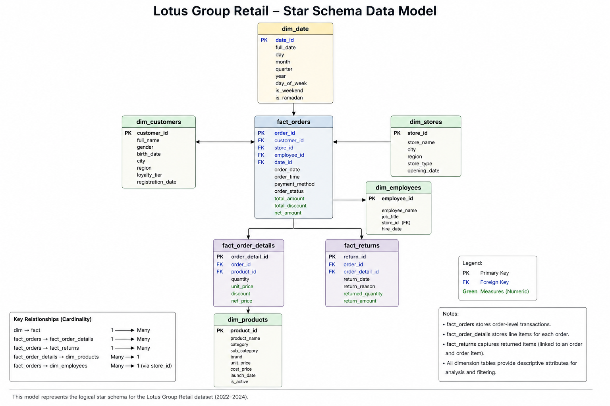

# Lotus Group Retail Performance Analysis
## 1. Business Context
Lotus Group is a retail business operating across multiple stores and serving customers across different regions. The company manages a diverse product portfolio and records sales, customer, employee, store, and returns data.

As the business operates across multiple stores and product categories, management needs a clear view of sales performance and profitability to support data-driven decision-making.

This project uses three years of retail data (2022–2024) to analyze the company's performance using SQL and Tableau Public.
## 2. Problem Statement
How is Lotus Group performing across stores, products, customers, and time, and what are the major opportunities to improve revenue, profitability, and operational performance?
## 3. Analytical Objectives & KPI Framework
### 3.1 Objective 1 - Evaluate Sales Performance
**Business Questions**
- How has Lotus Group's sales performance evolved from 2022 to 2024?
- Which stores and regions contribute the most to overall sales?
- Which product categories and products are the primary drivers of revenue?
#### Core KPIs
|KPI|Definition|
|---|---|
|**Total Revenue**|Total value of sales|
|**Total Orders**|Number of unique orders|
|**Units Sold**|Total quantity of products sold|
|**Average Order Value (AOV)**|Total Revenue ÷ Total Orders|
|**YoY Revenue Growth**|Year-over-year change in revenue|
### 3.2 Objective 2 - Assess Profitability
**Business Questions**
1. How does profitability vary across stores, products, and categories?
2. Which products and stores generate the highest profit margins?
3. Are the highest-revenue products and stores also the most profitable?
#### Core KPIs
| KPI                  | Definition                  |
| -------------------- | --------------------------- |
| **Gross Profit**     | Revenue − Cost              |
| **Profit Margin**    | Gross Profit ÷ Revenue      |
| **Profit per Order** | Gross Profit ÷ Total Orders |
### 3.3 Objective 3 - Understand Customer & Product Performance
**Business Questions**
1. Which customer segments contribute the greatest value?
2. How does purchasing behavior vary across loyalty tiers and regions?
3. Which products or categories have the strongest combination of sales and profitability?
#### Core KPIs
|KPI|Definition|
|---|---|
|**Active Customers**|Number of unique customers with recorded orders|
|**Revenue per Customer**|Total Revenue ÷ Unique Customers|
|**Orders per Customer**|Total Orders ÷ Unique Customers|
|**Average Order Value**|Total Revenue ÷ Total Orders|
### 3.4 Objective 4 — Evaluate Operational Performance
**Business Questions**
1. What is the overall scale and trend of product returns?
2. Which stores have the highest return rates, and what are the main reasons for returns?
3. How does performance vary across employees and stores?
4. How does retail performance differ between Ramadan and non-Ramadan periods?
#### Core KPIs
| KPI                      | Definition                                  |
| ------------------------ | ------------------------------------------- |
| **Return Rate**          | Returned Orders ÷ Total Orders*             |
| **Returned Orders**      | Number of orders associated with returns    |
| **Returned Value**       | Value associated with returned orders/items |
| **Revenue per Employee** | Revenue ÷ Number of Employees               |
## 4. Data Structure & Model
### 4.1 Data Overview
The dataset contains retail transaction and master data covering the period from **January 2022 to December 2024**. It consists of five dimension tables and four fact tables, providing information on customers, products, stores, employees, orders, order details, dates, and returns.

**Source:** https://www.kaggle.com/datasets/abdelrahmanmahmoud22/lotus-group-retail-star-schema-bi

|Table|Rows|Type|Description|
|---|--:|---|---|
|`dim_customers`|3,050|Dimension|Customer information and segmentation|
|`dim_date`|1,096|Dimension|Calendar and time attributes|
|`dim_employees`|216|Dimension|Employee and store assignment information|
|`dim_products`|345|Dimension|Product, category, brand, pricing and inventory information|
|`dim_stores`|15|Dimension|Store location and characteristics|
|`fact_orders_2022_2023`|7,942|Fact|Order-level transactions for 2022–2023|
|`fact_orders_2024`|4,058|Fact|Order-level transactions for 2024|
|`fact_order_details`|25,099|Fact|Product-level details for each order|
|`fact_returns`|1,056|Fact|Return transactions and refund information|
### 4.2 Understanding the tables
#### Dimension Tables
|Table|What one row represents|
|---|---|
|`dim_customers`|One customer|
|`dim_products`|One product|
|`dim_stores`|One store|
|`dim_employees`|One employee|
|`dim_date`|One calendar date|
#### Fact Tables
|Table|What one row represents|
|---|---|
|`fact_orders_2022_2023`|One order|
|`fact_orders_2024`|One order|
|`fact_order_details`|One product line within an order|
|`fact_returns`|One return transaction|
### 4.3 Data Model
The dataset follows a star-schema structure consisting of dimension tables that provide descriptive attributes and fact tables containing transactional information.

## 5. Data Preparation
### 5.1 Data Validation
The dataset was validated using SQL by reviewing table structures, row counts, and key uniqueness. The database contains nine tables and 12,000 orders across the 2022–2023 and 2024 order tables. The order IDs were unique across both tables. The customer dimension contained 50 exact duplicate records, which were addressed during the data-cleaning stage.
### 5.2 Data Cleaning
Several data-quality issues identified during validation were addressed before analysis. The customer dimension contained 50 exact duplicate records, which were removed while retaining one copy of each unique customer record. The `birth_date` field contained two valid date formats (`YYYY-MM-DD` and `DD/MM/YYYY`), while `registration_date` consistently used `YYYY-MM-DD`. Both fields were converted from text to the `DATE` data type. The `gender` field also contained inconsistent capitalization, which was standardized to `Male` and `Female`. Other relevant categorical fields, including `loyalty_tier` and `region`, were validated and required no changes.
### 5.3 Data Transformation
The two order tables, covering 2022–2023 and 2024, were combined into a single analytical view using `UNION ALL`. Prior validation confirmed that the two tables contained 12,000 unique orders with no overlapping `order_id` values. The resulting `fact_orders_all` view contains all 12,000 orders and provides a unified order-level dataset for subsequent analysis.
### 5.4 Final Validation
The prepared dataset was revalidated after cleaning and transformation. The customer dimension contains 3,000 unique customers, while the unified order dataset contains 12,000 unique orders. The order-detail data contains 25,099 records, and all order-detail records are associated with valid orders. These checks confirm that the prepared datasets are structurally consistent and ready for SQL analysis.
## 6. SQL Analysis
### 6.1 Sales Performance
#### Objective
This analysis evaluates Lotus Group's sales performance across the three-year period from 2022 to 2024. The analysis examines overall revenue, order volume, units sold, average order value, yearly revenue growth, store and regional performance, and the contribution of product categories and individual products to total revenue.
#### 6.1.1 Overall Sales Performance
| KPI                 |   Result |
| ------------------- | -------: |
| Total Revenue       |   45.35M |
| Total Orders        |   12,000 |
| Units Sold          |   43,313 |
| Average Order Value | 3,779.25 |

Across the 2022–2024 period, Lotus Group generated approximately **45.35M in revenue from 12,000 orders**, with **43,313 units sold**. The overall average order value was **3,779.25**.
#### 6.1.2 Revenue Trend
##### _Table 6.1 - YoY Revenue Performance_
| Year | Revenue | Orders | Units Sold | YoY Growth |      AOV |
| ---- | ------: | -----: | ---------: | ---------: | -------: |
| 2022 |  15.25M |  3,955 |     14,256 |          — | 3,856.82 |
| 2023 |  14.52M |  3,987 |     14,308 |     -4.83% | 3,640.91 |
| 2024 |  15.58M |  4,058 |     14,749 |     +7.33% | 3,839.56 |

Revenue declined by **4.83% in 2023**, despite a slight increase in order volume. This coincided with a decline in AOV from **3,856.82 to 3,640.91**, indicating that the increase in orders was not sufficient to offset the lower average order value. In 2024, revenue recovered with **7.33% year-over-year growth**, supported by continued order growth and an improvement in AOV to **3,839.56**.
#### 6.1.3 Store & Regional Performance
##### _Table 6.2 - Top 5 Stores by Revenue_
| Rank | Store | Region | Revenue | Orders | Units Sold |
|---|---|---|---:|---:|---:|
| 1 | Lotus Cairo Festival City | Greater Cairo | 6,070,853.50 | 1,676 | 5,892 |
| 2 | Lotus City Stars | Greater Cairo | 5,467,036.50 | 1,415 | 5,123 |
| 3 | Lotus Mall of Egypt | Greater Cairo | 5,168,939.00 | 1,580 | 5,860 |
| 4 | Lotus Alexandria City Centre | Alexandria | 4,488,620.50 | 1,150 | 4,090 |
| 5 | Lotus San Stefano | Alexandria | 3,843,826.00 | 951 | 3,602 |

Sales performance varies considerably across stores and regions. **Lotus Cairo Festival City** was the highest-revenue individual store, generating approximately **6.07M**. The three highest-revenue stores—Cairo Festival City, City Stars, and Mall of Egypt—were all located in **Greater Cairo**.
##### _Table 6.3 - Sales Performance by Region_
|Rank|Region|Revenue|Orders|Units Sold|
|--:|---|--:|--:|--:|
|1|Greater Cairo|16,706,829.00|4,671|16,875|
|2|Alexandria|8,332,446.50|2,101|7,759|
|3|Nile Delta|7,414,450.00|1,901|6,973|
|4|Canal Zone|6,476,891.00|1,635|5,925|
|5|Upper Egypt|2,829,136.00|795|2,707|
|6|Red Sea|2,270,525.50|562|1,940|
|7|South Sinai|1,320,701.00|335|1,334|

At the regional level, **Greater Cairo** was the largest contributor, generating approximately **16.71M**, followed by Alexandria at **8.33M** and the Nile Delta at **7.41M**. Greater Cairo therefore represented approximately **36.8% of total company revenue**, highlighting a significant concentration of sales in the region.
#### 6.1.4 Product Category & Product Performance
|Category|Revenue|Units Sold|
|---|--:|--:|
|Electronics|34.39M|4,686|
|Clothing|10.96M|38,627|

Product performance reveals a substantial difference between revenue contribution and sales volume. **Electronics generated 34.39M, approximately 75.8% of total revenue, despite accounting for only 4,686 units sold.** In contrast, Clothing generated 10.96M in revenue from 38,627 units. This indicates that Electronics is the primary revenue driver, while Clothing generates significantly higher sales volume.
##### _Table 6.4 - Top 10 Products by Revenue, 2022–2024_
|Rank|Product|Category|Subcategory|Brand|Revenue|Orders|Units Sold|
|--:|---|---|---|---|--:|--:|--:|
|1|iPhone 14 128GB|Electronics|Smartphones|Apple|2,215,260|411|494|
|2|Dell Inspiron 15 3000|Electronics|Laptops|Dell|2,210,415|409|493|
|3|HP Laptop 15|Electronics|Laptops|HP|2,121,900|393|477|
|4|Nintendo Switch OLED|Electronics|Gaming Consoles|Nintendo|1,849,980|337|405|
|5|iPhone 13 128 GB|Electronics|Smartphones|Apple|1,705,500|310|380|
|6|Samsung Galaxy S22|Electronics|Smartphones|Samsung|1,688,400|312|384|
|7|Lenovo IdeaPad 3|Electronics|Laptops|Lenovo|1,623,150|302|357|
|8|Sony PlayStation 5|Electronics|Gaming Consoles|Sony|1,582,200|292|348|
|9|Samsung 55" 4K Smart TV|Electronics|Televisions|Samsung|1,491,000|273|330|
|10|Apple MacBook Air M1|Electronics|Laptops|Apple|1,450,500|269|321|

The top revenue-generating products were all Electronics, led by the **iPhone 14 128GB**, **Dell Inspiron 15 3000**, and **HP Laptop 15**. This concentration reinforces the importance of Electronics to Lotus Group's overall revenue performance.
#### 6.1.5 Sales Performance Summary
The sales analysis indicates that Lotus Group generated strong overall revenue of **45.35M** across 12,000 orders during 2022–2024. Revenue experienced a decline in 2023 before recovering in 2024, while order volume increased consistently throughout the period. Store and regional performance was concentrated in Greater Cairo, which was the company's largest regional contributor. At the product level, Electronics was the dominant revenue category, while Clothing generated substantially higher unit volume. These results establish the key sales patterns that will be evaluated alongside profitability, customer behavior, and operational performance in the subsequent analyses.
### 6.2 Profitability
#### 6.2.1 Overall Profitability
|KPI|Result|
|---|--:|
|Total Revenue|45,350,979|
|Total Cost|35,648,150|
|**Gross Profit**|**9,702,829**|
|**Profit Margin**|**21.39%**|
|**Profit per Order**|**808.57**|

Across the 2022–2024 period, Lotus Group generated **45.35M in revenue** and incurred **35.65M in product costs**, resulting in **9.70M in gross profit**. The overall gross profit margin was **21.39%**, while average gross profit per order was **808.57**. Gross profit represents revenue after product costs and does not account for operating expenses.
#### 6.2.2 Profitability by Product Category
|Category|Revenue|Cost|Gross Profit|Profit Margin|Units Sold|
|---|--:|--:|--:|--:|--:|
|**Clothing**|10,959,159|5,759,750|**5,199,409**|**47.44%**|38,627|
|**Electronics**|34,391,820|29,888,400|4,503,420|13.09%|4,686|

Profitability differs substantially from the revenue pattern identified in Section 6.1. Although Electronics generated approximately **75.8% of total revenue**, it produced **4.50M in gross profit** at a **13.09% margin**. Clothing generated only **24.2% of revenue**, but produced **5.20M in gross profit** at a substantially higher **47.44% margin**. Clothing therefore contributed approximately **53.6% of total gross profit**, compared with approximately **46.4% from Electronics**.
#### 6.2.3 Profitability by Store
|Rank|Store|Region|Revenue|Gross Profit|Profit Margin|Profit per Order|
|--:|---|---|--:|--:|--:|--:|
|1|Lotus Cairo Festival City|Greater Cairo|6,070,853.50|**1,355,673.50**|22.33%|808.87|
|2|Lotus City Stars|Greater Cairo|5,467,036.50|**1,154,176.50**|21.11%|815.67|
|3|Lotus Mall of Egypt|Greater Cairo|5,168,939.00|**1,116,559.00**|21.60%|706.68|
|4|Lotus Alexandria City Centre|Alexandria|4,488,620.50|**940,350.50**|20.95%|817.70|
|5|Lotus San Stefano|Alexandria|3,843,826.00|**812,446.00**|21.14%|854.31|

Store profitability broadly follows the revenue pattern observed in Section 6.1, with the highest-revenue stores also generating the highest absolute gross profit. Lotus Cairo Festival City generated the highest gross profit at **1.36M**, followed by City Stars at **1.15M** and Mall of Egypt at **1.12M**. However, differences in profit margin and profit per order show that revenue scale and profitability efficiency are not identical measures.
#### 6.2.4 Product Profitability
|Rank|Product|Category|Revenue|Gross Profit|Profit Margin|
|--:|---|---|--:|--:|--:|
|1|Dell Inspiron 15 3000|Electronics|2,210,415|**342,115**|15.48%|
|2|HP Laptop 15|Electronics|2,121,900|**284,400**|13.40%|
|3|iPhone 14 128GB|Electronics|2,215,260|**263,360**|11.89%|
|4|Nintendo Switch OLED|Electronics|1,849,980|**243,480**|13.16%|
|5|LG 50 OLED TV 4K|Electronics|1,662,345|**239,945**|14.43%|
|6|iPhone 13 128GB|Electronics|1,705,500|**229,500**|13.46%|
|7|Apple iPad 10th Gen|Electronics|1,636,845|**220,845**|13.49%|
|8|Samsung 55 Smart TV 4K|Electronics|1,660,560|**197,760**|11.91%|
|9|Lenovo IdeaPad 3 15|Electronics|1,421,905|**195,205**|13.73%|
|10|Sony PS5 Console|Electronics|1,659,450|**194,250**|11.71%|

The top 10 products by gross profit were all Electronics products. The Dell Inspiron 15 3000 generated the highest gross profit at **342,115**, despite ranking second in revenue among the products analyzed. This demonstrates that higher revenue does not necessarily result in higher absolute profit, as differences in product margins affect profitability.
#### 6.2.5 Revenue vs Profitability
The comparison between revenue and profitability shows that revenue leadership does not always correspond to profit leadership. For example, the iPhone 14 128GB generated the highest revenue among the top products at **2.22M**, but its gross profit was **263,360** with an **11.89% margin**. The Dell Inspiron 15 3000 generated slightly lower revenue of **2.21M**, but produced **342,115 in gross profit** with a **15.48% margin**.
#### 6.2.6 Profitability Summary
Lotus Group generated **9.70M in gross profit** at an overall margin of **21.39%** during 2022–2024. The profitability analysis revealed a significant difference between revenue contribution and profit contribution across product categories. Electronics generated the majority of revenue, while Clothing generated the majority of gross profit due to its substantially higher margin. At the store level, the highest-revenue locations also generated the highest absolute gross profit, although profit per order varied across stores. At the product level, differences in margins meant that revenue ranking did not always correspond to gross profit ranking. These findings demonstrate the importance of evaluating both revenue and profitability when assessing business performance.
### 6.3 Customer & Product Performance
This analysis evaluates customer and product performance by examining loyalty tiers, customer regions, individual customer value, and product-category purchasing behavior. The objective is to understand which customer groups contribute the greatest value and how purchasing behavior differs across customers and product categories.
#### 6.3.1 Customer Performance by Loyalty Tier
|Loyalty Tier|Customers|Revenue|Orders|Revenue / Customer|Orders / Customer|AOV|
|---|--:|--:|--:|--:|--:|--:|
|Bronze|1,517|22,566,354.50|6,154|14,875.65|4.06|3,666.94|
|Silver|866|13,902,370.00|3,502|16,053.55|4.04|3,969.84|
|Gold|432|6,910,670.50|1,815|15,996.92|4.20|3,807.53|
|Platinum|130|1,971,584.00|529|15,166.03|4.07|3,727.00|

Customer performance was analyzed across the four loyalty tiers using customer count, revenue, order frequency, revenue per customer, and average order value. Bronze customers generated the highest total revenue at **22.57M**, primarily due to their larger customer population. In contrast, Silver customers recorded the highest revenue per customer at **16,053.55**, while Gold customers had the highest orders per customer at **4.20**. This indicates that differences in total revenue are influenced by customer population, while revenue per customer and order frequency provide additional insight into customer behavior and value.
#### 6.3.2 Customer Performance by Region
|Region|Customers|Revenue|Orders|Revenue / Customer|Orders / Customer|AOV|
|---|--:|--:|--:|--:|--:|--:|
|Greater Cairo|1,346|20,664,352.50|5,520|15,352.42|4.10|3,743.54|
|Nile Delta|481|7,043,316.50|1,977|14,643.07|4.11|3,562.63|
|Alexandria|398|6,045,001.50|1,586|15,188.45|3.98|3,811.48|
|Canal Zone|321|5,241,541.50|1,300|16,328.79|4.05|4,031.96|
|Upper Egypt|209|3,503,954.00|867|16,765.33|4.15|4,041.47|
|Red Sea|162|2,275,544.50|630|14,046.57|3.89|3,611.98|
|South Sinai|28|577,268.50|120|20,616.73|4.29|4,810.57|

Customer performance was analyzed across regions using customer count, revenue, order frequency, revenue per customer, and average order value. Greater Cairo had the largest customer base with **1,346 customers** and generated the highest revenue at **20.66M**. Customer-level metrics varied across regions, with South Sinai recording the highest revenue per customer at **20,616.73** and the highest AOV at **4,810.57**; however, these figures are based on only **28 customers** and should therefore be interpreted in the context of its relatively small customer base.
#### 6.3.3 Customer Value
|Customer|Loyalty Tier|Region|Revenue|Orders|Units|AOV|
|---|---|---|--:|--:|--:|--:|
|Hazem Amin|Silver|Alexandria|123,695.00|4|23|30,923.75|
|Bassem Fathy|Gold|Nile Delta|118,988.50|7|34|16,998.36|
|Ramy Wahba|Bronze|Nile Delta|117,708.00|4|31|29,427.00|
|Reem Hamdy|Platinum|Upper Egypt|116,614.00|7|25|16,659.14|
|Aisha Hafez|Silver|Greater Cairo|114,364.00|8|30|14,295.50|
|Neveen Attia|Silver|Greater Cairo|112,100.00|8|35|14,012.50|
|Khaled Rizk|Gold|Greater Cairo|110,789.50|3|20|36,929.83|
|Nadia Hassan|Silver|Red Sea|110,525.50|7|33|15,789.36|
|Radwa Gouda|Silver|Canal Zone|109,458.00|7|27|15,636.86|
|Bassem Hamdy|Gold|Greater Cairo|109,320.50|11|49|9,938.23|

Customer-level analysis was used to identify the highest-value customers based on total revenue generated during the 2022–2024 period. Hazem Amin generated the highest revenue at **123,695**, while Khaled Rizk recorded the highest average order value at **36,929.83** across three orders. In contrast, Bassem Hamdy placed the highest number of orders and purchased the most units among the top 10 customers, with **11 orders and 49 units**, but had a lower average order value of **9,938.23**. These results indicate that customer value can be driven by different combinations of purchase frequency, units purchased, and transaction value.
#### 6.3.4 Product Performance from a Customer Perspective
|Category|Customers|Orders|Units Sold|Revenue|Revenue / Customer|Orders / Customer|
|---|--:|--:|--:|--:|--:|--:|
|Electronics|1,692|2,477|4,686|34,391,820.00|20,326.13|1.46|
|Clothing|2,933|11,411|38,627|10,959,159.00|3,736.50|3.89|

Category-level order counts are not additive because a single order may contain products from both categories. Product-category performance was evaluated from a customer perspective by examining customer reach, purchase frequency, and revenue generated per customer. Electronics was purchased by **1,692 unique customers** and generated **34.39M** in revenue, resulting in revenue of **20,326.13 per customer**. However, customers purchasing Electronics placed an average of only **1.46 orders**. Clothing reached a substantially larger customer base of **2,933 customers** and generated **3.89 orders per customer**, although revenue per customer was lower at **3,736.50**. These results highlight two distinct purchasing patterns: higher-value but less frequent Electronics purchases and lower-value but more frequent Clothing purchases.
#### 6.3.5 Customer & Product Performance Summary
Customer and product analysis revealed meaningful differences in customer scale, purchase frequency, and transaction value. Bronze customers generated the highest total revenue at **22.57M**, primarily due to their larger customer population, while Silver customers recorded the highest revenue per customer at **16,053.55**. Greater Cairo had the largest customer base and generated the highest customer revenue at **20.66M**. At the individual level, high-value customers displayed different purchasing patterns, with some generating value through larger average orders and others through more frequent purchases. Product-category analysis showed a similar contrast: Electronics generated substantially higher revenue per customer at **20,326.13**, while Clothing reached more customers and generated more frequent purchases, with **3.89 orders per customer**. Overall, these results demonstrate that customer performance should not be evaluated using total revenue alone; customer population, purchase frequency, average order value, and product-category behavior provide additional context for understanding customer value.
### 6.4 Operational Performance
#### 6.4.1 Returns Performance
|Store|Region|Total Orders|Returned Orders|Return Rate|Returned Value|
|---|---|--:|--:|--:|--:|
|Lotus Sharm Plaza|South Sinai|335|34|10.15%|93,370.50|
|Lotus Aswan Plaza|Upper Egypt|461|46|9.98%|123,217.50|
|Lotus Luxor Mall|Upper Egypt|334|33|9.88%|45,230.50|
|Lotus San Stefano|Alexandria|951|91|9.57%|344,166.00|
|Lotus Cairo Festival City|Greater Cairo|1,676|158|9.43%|665,359.50|
|Lotus Mansoura Mega Mall|Nile Delta|842|78|9.26%|433,222.50|
|Lotus City Stars|Greater Cairo|1,415|128|9.05%|572,670.00|
|Lotus Alexandria City Centre|Alexandria|1,150|103|8.96%|449,813.50|
|Lotus Mall of Egypt|Greater Cairo|1,580|138|8.73%|384,463.50|
|Lotus Ismailia Festival|Canal Zone|429|35|8.16%|127,187.50|
|Lotus Port Said Mega|Canal Zone|609|49|8.05%|191,834.50|
|Lotus Hurghada Waterfront|Red Sea|562|45|8.01%|116,927.00|
|Lotus Zagazig Stars|Nile Delta|504|40|7.94%|79,454.50|
|Lotus Suez Canal Mall|Canal Zone|597|45|7.54%|235,422.00|
|Lotus Tanta Stars|Nile Delta|555|33|5.95%|150,773.50|
##### Return Reasons
|Return Reason|Return Count|Returned Value|% of Returns|
|---|--:|--:|--:|
|Duplicate Order|197|857,428.50|18.66%|
|Defective Product|181|518,491.00|17.14%|
|Wrong Item Delivered|175|627,004.50|16.57%|
|Size Issue|173|617,976.00|16.38%|
|Changed Mind|172|739,372.50|16.29%|
|Quality Issue|158|652,840.00|14.96%|

Across 2022–2024, Lotus Group recorded **1,056 returned orders out of 12,000 total orders**, resulting in an overall return rate of **8.80%** and returned value of **4.01M**. The return rate declined from **9.13% in 2022** to **8.45% in 2023**, before increasing slightly to **8.82% in 2024**. At store level, return rates ranged from **5.95% at Tanta Stars** to **10.15% at Sharm Plaza**. Return reasons were relatively distributed, with **Duplicate Order** being the most frequent at 18.66%, followed by **Defective Product** at 17.14% and **Wrong Item Delivered** at 16.57%. Of the 1,056 return records, **819 were refunded, 150 were pending, and 87 were rejected**, indicating that the majority of recorded returns had reached a refunded status.
#### 6.4.2 Employee & Store Performance
|Store|Region|Employees|Revenue|Orders|Revenue / Employee|
|---|---|--:|--:|--:|--:|
|Lotus Alexandria City Centre|Alexandria|16|4,488,620.50|1,150|280,538.78|
|Lotus Mansoura Mega Mall|Nile Delta|14|3,481,144.50|842|248,653.18|
|Lotus Port Said Mega|Canal Zone|11|2,575,741.50|609|234,158.32|
|Lotus Suez Canal Mall|Canal Zone|10|2,324,785.00|597|232,478.50|
|Lotus City Stars|Greater Cairo|24|5,467,036.50|1,415|227,793.19|
|Lotus Aswan Plaza|Upper Egypt|8|1,773,820.50|461|221,727.56|
|Lotus Tanta Stars|Nile Delta|10|2,187,585.00|555|218,758.50|
|Lotus Cairo Festival City|Greater Cairo|28|6,070,853.50|1,676|216,816.20|
|Lotus San Stefano|Alexandria|18|3,843,826.00|951|213,545.89|
|Lotus Mall of Egypt|Greater Cairo|26|5,168,939.00|1,580|198,805.35|
|Lotus Hurghada Waterfront|Red Sea|12|2,270,525.50|562|189,210.46|
|Lotus Ismailia Festival|Canal Zone|9|1,576,364.50|429|175,151.61|
|Lotus Zagazig Stars|Nile Delta|10|1,745,720.50|504|174,572.05|
|Lotus Luxor Mall|Upper Egypt|7|1,055,315.50|334|150,759.36|
|Lotus Sharm Plaza|South Sinai|13|1,320,701.00|335|101,592.38|

Revenue per employee varied considerably across stores. Alexandria City Centre recorded the highest revenue per employee at **280,538.78**, followed by Mansoura Mega Mall at **248,653.18** and Port Said Mega at **234,158.32**. Sharm Plaza recorded the lowest revenue per employee at **101,592.38**. The results show that store revenue alone does not fully describe operational performance, as stores with different staffing levels can generate substantially different revenue per employee.
#### 6.4.3 Ramadan vs Non-Ramadan Performance
|Period|Average Daily Revenue|Average Order Value|
|---|--:|--:|
|Non-Ramadan|41.2K|3,829.63|
|Ramadan|36.1K|3,228.10|

Average daily revenue was approximately **41.2K during non-Ramadan periods**, compared with approximately **36.1K during Ramadan**. Average order value was also lower during Ramadan at **3,228.10**, compared with **3,829.63** during non-Ramadan periods, a difference of approximately **15.7%**.

Because Ramadan and non-Ramadan periods contain different numbers of days in the dataset, average daily revenue provides a more appropriate comparison than total revenue across the two periods. The results indicate an observed difference in sales intensity between the two periods, but do not establish that Ramadan itself caused the difference.
#### 6.4.4 Operational Performance Summary
Operational analysis showed meaningful differences in returns, staffing efficiency, and performance across Ramadan and non-Ramadan periods. Lotus Group recorded an overall return rate of **8.80%**, with store-level return rates ranging from **5.95% to 10.15%**. Return reasons were distributed across duplicate orders, defective products, wrong items, size issues, changed minds, and quality issues, while **819 of 1,056 returns were refunded**. Revenue per employee also varied substantially by store, ranging from **101,592.38 at Sharm Plaza** to **280,538.78 at Alexandria City Centre**, demonstrating differences in revenue generation relative to staffing levels. Average daily revenue was also lower during Ramadan, at approximately 36.1K compared with 41.2K during non-Ramadan periods, while average order value was 3,228.10 compared with 3,829.63. Together, these results provide an operational view of returns, workforce efficiency, and seasonal sales patterns.
### 6.5 Analysis Summary
The SQL analysis identified several important patterns in Lotus Group's performance from 2022–2024. Total revenue reached **45.35M** across **12,000 orders**, with revenue increasing by **7.33% in 2024** after declining by **4.83% in 2023**. Electronics generated approximately **75.8% of total revenue**, while Clothing generated a substantially higher profit margin of **47.44%** compared with **13.09% for Electronics**, highlighting the difference between revenue contribution and profitability. Customer analysis showed differences across loyalty tiers and regions, while Electronics customers generated higher revenue per customer but purchased less frequently than Clothing customers. Operationally, the overall return rate was **8.80%**, revenue per employee varied considerably across stores, and Ramadan periods showed lower sales and average order value than non-Ramadan periods. Together, these findings establish the main performance patterns that will be explored further through the Tableau Public data model and dashboard.
## 7. Tableau Public Data Model, Calculations & Dashboard
### 7.1 Tableau Data Preparation
The SQL preparation stage produced a cleaned and validated analytical layer for Tableau. The customer data was prepared in `dim_customers_clean`, containing **3,000 unique customers**, while the two order tables were unified into the `fact_orders_all` view containing **12,000 unique orders**. The remaining dimension and fact tables provide product, store, employee, date, order-detail, and return information required for the dashboard. The Tableau layer uses these prepared datasets while preserving their original data grain to avoid duplicated measures and incorrect aggregations. The SQL source tables remain unchanged, ensuring that the cleaned analytical layer can be traced back to the original data.
### 7.2 Tableau Data Model
|Table|Grain|Relationship Key|Related Table|
|---|---|---|---|
|`fact_orders_all`|One row per order|`Customer Id`|`dim_customers_clean`|
|`fact_orders_all`|One row per order|`Store Id`|`dim_stores`|
|`fact_orders_all`|One row per order|`Date Id`|`dim_date`|
|`fact_orders_all`|One row per order|`Employee Id`|`dim_employees`|
|`fact_orders_all`|One row per order|`Order Id`|`fact_order_details`|
|`fact_order_details`|One row per order-product line|`Product Id`|`dim_products`|
|`fact_orders_all`|One row per order|`Order Id`|`fact_returns`|

The Tableau data model uses `fact_orders_all` as the central order-level fact table, with customer, store, date, and employee dimensions connected through their respective keys. The order-detail table is related through `Order Id` and connects to the product dimension through `Product Id`, preserving the distinction between order-level and product-line-level data. The returns table is related directly to orders because it does not contain a `Product Id`, preventing unsupported product-level return attribution. Relationships were used rather than physical joins to preserve the native grain of each table and reduce the risk of duplicated measures during analysis.
### 7.3 Tableau Calculated Fields & Validation
|Calculated Field|Formula|Validated Result|
|---|---|--:|
|**Gross Profit**|`SUM([Line Total Revenue]) - SUM([Line Total Cost])`|9,702,829|
|**Profit Margin**|`[Gross Profit] / SUM([Line Total Revenue])`|21.39%|
|**Average Order Value**|`SUM([Line Total Revenue]) / COUNTD([Order Id])`|3,779.25|
|**Profit per Order**|`[Gross Profit] / COUNTD([Order Id])`|808.57|
|**Active Customers**|`COUNTD([Customer Id])`|2,945|
|**Revenue per Customer**|`SUM([Line Total Revenue]) / COUNTD([Customer Id])`|15,399.99|
|**Orders per Customer**|`COUNTD([Order Id]) / COUNTD([Customer Id])`|4.07|
|**Ramadan Period**|`IF [Is Ramadan] = 1 THEN "Ramadan" ELSE "Non-Ramadan" END`|Validated|
|**Returned Orders**|`COUNTD([Return Id])`|1,056|
|**Return Rate**|`[Returned Orders] / COUNTD([Order Id])`|8.80%|
|**Revenue per Employee**|`SUM([Line Total Revenue]) / COUNTD([Employee Id])`|Validated at store level|
|**YoY Revenue Growth**|Tableau Quick Table Calculation → Year over Year Growth|2023: -4.83%, 2024: +7.33%|

The Tableau data model uses calculated fields to define the core business KPIs required for the dashboard. These calculations were validated against the corresponding SQL results to ensure consistency between the SQL analysis and Tableau reporting.

The Tableau calculations produced results consistent with the SQL analysis, with minor differences only from display rounding. Validation also distinguished between the **3,000 customers** in the cleaned customer dimension and the **2,945 active customers** appearing in the order data. The returns calculation was refined to use `Return Id`, ensuring that the dashboard correctly counts the **1,056 recorded return transactions**. With the core calculations validated, the Tableau dashboard was finalized and published for interactive analysis.
### 7.4 Tableau Dashboard Requirements, Design & Validation
The Tableau Public dashboard was designed to provide a single interactive view of Lotus Group's sales, profitability, customer, and operational performance. The dashboard combines KPI cards with trend, category, store, loyalty, returns, and Ramadan analysis to support both high-level performance monitoring and deeper exploration.

The dashboard includes the following interactive filters:

- **Year**
- **Store**
- **Product Category**
- **Loyalty Tier**

The main dashboard views include:

- Revenue Trend (2022–2024)
- Revenue by Product Category
- Gross Profit & Margin by Product Category
- Revenue by Store
- Revenue by Loyalty Tier
- Return Rate by Store
- Return Reasons
- Average Daily Revenue: Ramadan vs Non-Ramadan

The dashboard was designed with a simple layout: filters and KPI cards are positioned at the top, followed by the main performance and profitability views, with customer and operational analysis presented below. The dashboard preserves the native grain of the underlying data model and uses the validated Tableau calculations developed in Section 7.3.

The final dashboard was validated against the SQL analysis to confirm consistency in core metrics. Total Revenue, Total Orders, Units Sold, Gross Profit, Profit Margin, Average Order Value, Active Customers, Returned Orders, Return Rate, and YoY Revenue Growth matched the SQL results, with only minor differences caused by display rounding. The final dashboard was published to **Tableau Public** for interactive portfolio presentation.
## 8. Key Insights
### 8.1 Revenue Performance
- Total revenue across 2022–2024 was **45.35M** from **12,000 orders** and **43,313 units sold**.
- Revenue declined by **4.83% in 2023** compared with 2022, before recovering with **7.33% growth in 2024**.
- **Greater Cairo** generated the largest regional share of revenue at approximately **36.8%** of total revenue.
- **Cairo Festival City** was the highest-revenue store, generating approximately **6.07M**.
### 8.2 Product & Profitability Performance
- **Electronics generated 34.39M**, representing approximately **75.8% of total revenue**, compared with **10.96M** from Clothing.
- Despite its lower revenue contribution, **Clothing generated 5.20M in gross profit**, compared with **4.50M from Electronics**.
- Clothing had a substantially higher **47.44% gross margin**, compared with **13.09% for Electronics**.
- This indicates that revenue contribution and profitability contribution differ significantly across product categories.
### 8.3 Customer Performance
- The cleaned customer dimension contains **3,000 unique customers**, while **2,945 customers appear in the transactional order data** and are therefore classified as active customers in Tableau.
- **Bronze customers generated the largest revenue contribution**, at approximately **22.57M**, followed by Silver customers at **13.90M**.
- South Sinai had the smallest customer base at **28 customers**, while Greater Cairo had the largest at **1,346 customers**.
- Revenue per customer varied considerably across regions, indicating differences in customer value and purchasing behavior.
### 8.4 Operational Performance
- The overall return rate was **8.80%**, with **1,056 returned orders** and **4.01M in returned value**.
- **Duplicate Order** was the most frequent return reason, accounting for **197 returns**, followed by **Defective Product (181)** and **Wrong Item Delivered (175)**.
- Return rates varied across stores, ranging from **5.95% at Tanta Stars** to **10.15% at Sharm Plaza**.
- Revenue per employee also varied across stores, with **Alexandria City Centre** recording the highest value at approximately **280.5K per employee**.
### 8.5 Ramadan Performance
- Average daily revenue was approximately **41.2K during non-Ramadan periods** compared with approximately **36.1K during Ramadan**.
- The analysis identifies an observed difference in average daily revenue between the two periods; it does not establish that Ramadan itself caused the difference.
### 8.6 Overall Finding
The analysis shows that Lotus Group's performance differs substantially across **product categories, stores, customer segments, and operating conditions**. Electronics drives the majority of revenue, while Clothing contributes a larger share of gross profit relative to its revenue contribution. Store-level performance also varies in both revenue generation and return rates, highlighting areas where management can investigate differences in sales and operational performance.
## 9. Business Recommendations
Based on the findings from the SQL analysis and Tableau dashboard, the following recommendations can be considered:
### 9.1 Balance Revenue Growth with Profitability
Electronics generates the majority of revenue but has a substantially lower gross margin than Clothing. Management could review **pricing, supplier costs, product mix, and promotional activity** within Electronics to identify opportunities to improve margins without reducing sales volume.
### 9.2 Investigate Store-Level Performance Differences
Revenue and return rates vary considerably across stores. Management should investigate the operational practices of stores with **higher return rates** and compare them with stores showing lower rates. This can help identify potential differences in order accuracy, product handling, or customer service.
### 9.3 Address the Main Return Drivers
**Duplicate orders, defective products, wrong-item deliveries, and size issues** account for a large share of recorded returns. These areas should be investigated further to determine whether process improvements in order validation, fulfillment, quality control, or product information could reduce avoidable returns.
### 9.4 Strengthen High-Value Customer Segments
Customer value varies across loyalty tiers and regions. Management could use the existing loyalty program to identify **high-value customers and purchasing patterns** and develop targeted retention or cross-selling initiatives.
### 9.5 Investigate Regional and Store-Level Opportunities
Greater Cairo contributes the largest share of revenue, while revenue per employee and customer value vary across regions and stores. Management could compare the practices of higher-performing locations with lower-performing locations to identify operational approaches that may be transferable.
### 9.6 Monitor Revenue Recovery
Revenue declined in 2023 before increasing in 2024. Management should continue monitoring the revenue trend and determine whether the 2024 recovery is sustained across future periods, particularly at the store and category levels.
### 9.7 Use the Dashboard for Ongoing Performance Monitoring
The Tableau Public dashboard provides an interactive way to monitor revenue, profitability, customer performance, and operational metrics. Management can use the dashboard to investigate performance differences by **year, store, product category, and loyalty tier** and identify areas requiring further analysis.
## 10. Limitations
This analysis has several limitations that should be considered when interpreting the results.
### 10.1 Dataset Scope
The analysis is based on the available **2022–2024 retail dataset**. The findings therefore describe the performance represented in this period and may not reflect more recent business conditions.
### 10.2 Customer Coverage
The cleaned customer dimension contains **3,000 unique customers**, while **2,945 customers have matching order activity**. Customer-level metrics in Tableau therefore represent active customers rather than the complete customer dimension.
### 10.3 Return Data Granularity
The returns table contains `Order Id` but does not contain `Product Id`. As a result, returns can be analyzed at the **order, store, and return-reason levels**, but return values cannot be reliably attributed to individual products or product categories when an order contains multiple products.
### 10.4 Gross Profit Definition
Gross profit is calculated as:
**Revenue − Product Cost**
It does not include other potential business expenses such as salaries, rent, marketing, logistics, or administrative costs. Therefore, the profitability analysis should not be interpreted as a measure of net profit.
### 10.5 Observational Analysis
The analysis identifies relationships and performance differences within the dataset but does not establish causation. For example, the difference in average daily revenue between Ramadan and non-Ramadan periods does not demonstrate that Ramadan itself caused the difference.
### 10.6 Source Data Quality
The original data contained issues such as duplicate customer records, inconsistent gender capitalization, NULL email values, and date fields stored as text. These issues were addressed during SQL preparation, but other unobserved data-quality issues may remain.
### 10.7 Business Context
The dataset does not provide all possible contextual factors that could explain changes in performance, such as marketing campaigns, promotions, competitor activity, inventory availability, or changes in supplier costs. Therefore, some observed differences require further investigation before operational decisions are made.
## 11. Conclusion
This project analyzed Lotus Group's retail performance across **sales, profitability, customers, products, stores, and returns** using SQL and Tableau Public.

The analysis showed that the business generated **45.35M in revenue across 12,000 orders**, with **9.70M in gross profit and a 21.39% gross margin** during 2022–2024. Revenue declined in 2023 before recovering in 2024, while significant differences were observed across product categories, stores, customer segments, and operational metrics.

Electronics was the primary revenue driver, while Clothing generated a substantially higher gross margin. Store-level analysis highlighted differences in revenue, return rates, and revenue per employee, while the returns analysis identified the main reasons contributing to returned orders.

The project demonstrates an end-to-end analytical workflow, beginning with **data validation and cleaning in SQL**, followed by **business-focused analysis and KPI development**, and ending with an **interactive Tableau Public dashboard**. The SQL results and Tableau calculations were validated against each other to maintain consistency throughout the analysis.

Overall, the project demonstrates practical skills in **SQL data preparation, analytical querying, KPI development, data modeling, Tableau visualization, dashboard design, and business-oriented interpretation**.
